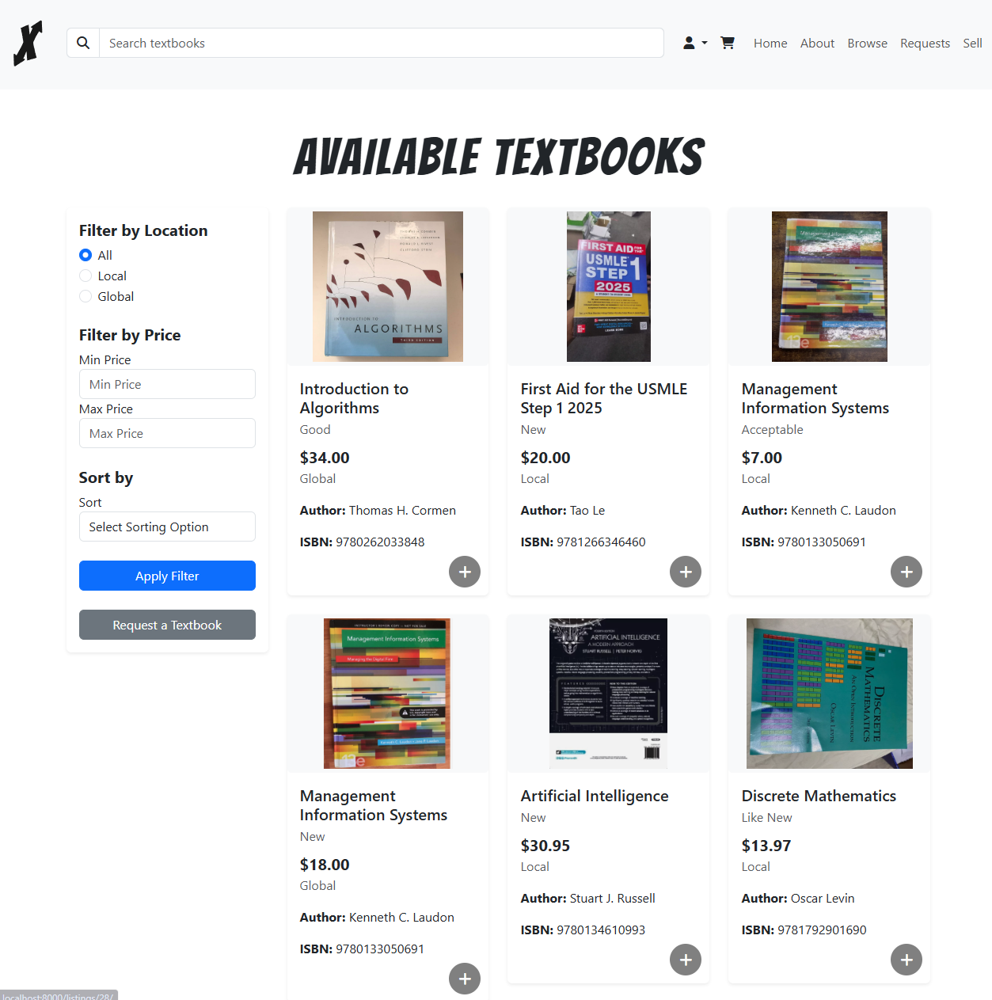
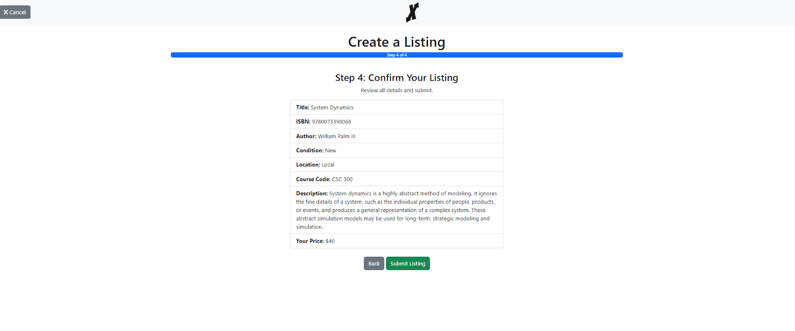

# Textbook X Change
Textbook-X-Change is a student-focused marketplace aimed simplifying college life and cutting costs by creating a platform where students can swap, sell, or buy textbooks directly from peers in their campus community.

### Features
- **📚 Textbook Listings:** Students can create listings fast with autofilled book details from the ISBN, and pricing suggestions powered by internal and web scraping data.
- **🔍 Search and Filter:** Advanced search and filtering options to find textbooks by title, author, ISBN, subject, condition, price range, and location.
- **🔒 User Authentication:** Secure registration and login functionality.
- **📦 Containerized Deployment:** Easy setup and scalable deployment using Docker compose.
- **🖼️ Image Storage:** Using AWS S3 to store listing images uploaded by users.

Powered by Python, Django, and PostgreSQL with a frontend using HTML and Bootstrap components.

## Gallery

## Build and run

First configure a `.env` file based on the example shown in [.env.example](/.env.example)

When you're ready, start the application by running:
`docker compose up --build`

or in development you can use the watch attribute to automatically watch for and sync file
changes into they running docker container to make testing changes easier:

`docker compose up --build --watch`.

The application will be available at http://127.0.0.1:8000.

If you have any issue you can try to run the DB migrations:
`docker compose run django-web python manage.py migrate`

You will also need to run the management command to load in the schools dataset:

`docker compose run django-web python manage.py loadschools ./us-colleges-and-universities.csv`

If you need to delete all users from the db do the following in order

`docker-compose down`
`docker-compose up -d`
`docker exec -it poc-demo-team-two-django-web-1 /bin/bash`
`python manage.py shell`
`from django.contrib.auth.models import User`
`User.objects.all().delete()`
`docker logs poc-demo-team-two-db-1`

